# Implementation of Splut! in Prolog

This project was developed for the course Functional and Logic Programming, with the aim of implementing a two-player board game in the Prolog language. The board game is defined by its distinctive board and pieces, the rules governing piece movement (including possible moves), and the conditions that determine the game's outcome, whether it results in defeat or victory.

## Group Information

**Class**: 3LEIC14

**Group**: Splut1

**Members**: 

| Student Number | Name          | Contribution |
| -------------- | ------------- | ------------ |
| 202105385      | Luís Du       | 34 %         |
| 202005832      | Luís Sousa | 33 %         |
| 202108783      | Tiago Gouveia | 33 %         |

## Installation and Execution

1. **Download and Extract:**
   - Download the zip file containing our project.
   - Extract the contents of the zip file to a directory of your choice.

2. **Open SICStus Prolog:**
   - Open a terminal window in the project directory.
   - Type `sicstus` and press Enter to launch SICStus Prolog.

3. **Consult Main File:**
   - Inside the SICStus Prolog console, consult the `main.pl` file by typing:
     ```prolog
     ?- consult('src/main.pl').
     ```

4. **Start Playing:**
   - To start playing the game, type:
     ```prolog
     ?- play.
     ```
   -  Enjoy the game!


## Description of the game

**Splut!** is a 2-4 players abstract board game. In **Splut!**, players control unique characters like Stonetrolls, Dwarves, and Sorcerers on a diamond-shaped board. The goal is simple: eliminate all opposing Sorcerers by cleverly moving your pieces and strategically using Rocks.

### Game Objective

The objective of Splut! is to eliminate all opposing Sorcerers by landing a Rock on their heads. When a Sorcerer is eliminated, the entire team is removed from the board.

### Components

- **Game Board:** A diamond-shaped board with squares.
- **Players:** Red and Blue, each with a Stonetroll, a Dwarf, and a Sorcerer.
- **Special Pieces:** 4 Rocks, each placed in a corner of the diamond-shaped game board.

### Gameplay

- Players take turns, with each player making 3 steps per turn.
- The first player makes 1 step on their first turn, and the second player makes 2 steps on their first turn.
- Steps involve moving one of your pieces to an adjacent square horizontally or vertically.

### Stonetroll Moves

- **Pulling a Rock:** Stonetrolls can pull Rocks from squares right behind them.

   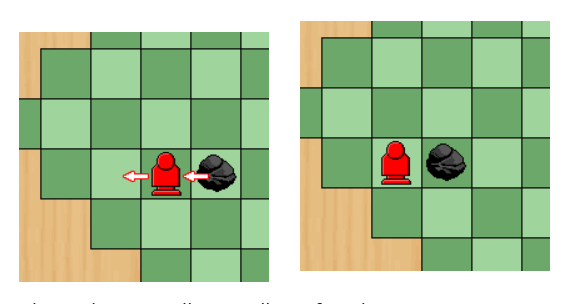

- **Throwing a Rock:** Stonetrolls can throw Rocks horizontally or vertically. Rocks continue until they hit an obstacle (board edge, Stonetroll, Sorcerer, or another Rock). If a Sorcerer is hit, the corresponding team is eliminated. Throwing a Rock immediately ends the player's turn even if he made less than 3 steps.

   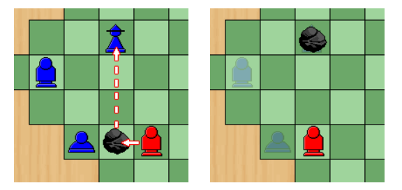


### Dwarf Moves

- **Pushing Pieces:** Dwarves can push consecutive pieces (including Rocks) in a straight line. All pushed pieces move one square in the direction of the Dwarf's movement.

   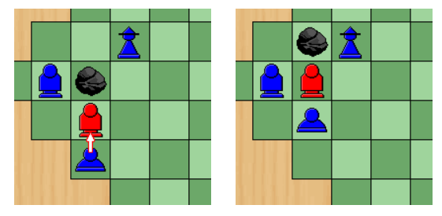


### Sorcerer Moves

- **Levitating Rocks:** Sorcerers can levitate stationary Rocks (rocks that weren't pushed, pulled, thrown or levitated on the previous player's turn)to an empty square in the same direction as their movement. Levitation is optional but continuous during a turn.

   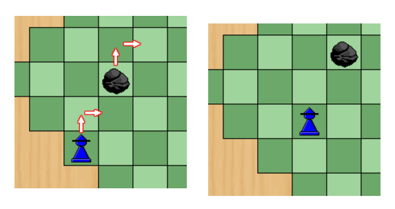


Information gathered in: 
 - https://www.iggamecenter.com/en/rules/splut
 - https://bodogemu.com/pt/games/splut


## Game Logic

### Internal Game State Representation

The game state is represented by:

- **Board:** a square matrix (list of lists) with different atoms for the pieces (*r* for rocks, *s* for Sorcerers, *t* for Stonetrolls, *d* for Dwarves, *x-x* for empty spaces, *e-e* for cells outside the playing board)
- **Player:** the current player taking their turn, denoted by atoms *p1* or *p2*.
- **NrMoves:** the number of moves that the player has played in their turn. It can go up to 3.
- **NrTurns:** the number of turns that were played until the game finished. 

To simplify operations and reduce the amount of recursive iterations through the board matrix we created a set of dynamic predicates **position/2**, composed by two tuples, one with the piece and the player it belongs to, and the other with the coordinates of the piece in the board.

```
% position(+Piece, +Position)
:- dynamic position/2.
```

#### Initial game state representation

```
GameState([
    [ e-e , e-e , e-e , e-e  , r-1  , e-e  , e-e , e-e , e-e ],
    [ e-e , e-e , e-e , t-p2 , d-p2 , s-p2 , e-e , e-e , e-e ],
    [ e-e , e-e , x-x , x-x  , x-x  , x-x  , x-x , e-e , e-e ], 
    [ e-e , x-x , x-x , x-x  , x-x  , x-x  , x-x , x-x , e-e ],
    [ r-1 , x-x , x-x , x-x  , x-x  , x-x  , x-x , x-x , r-3 ], 
    [ e-e , x-x , x-x , x-x  , x-x  , x-x  , x-x , x-x , e-e ],
    [ e-e , e-e , x-x , x-x  , x-x  , x-x  , x-x , e-e , e-e ], 
    [ e-e , e-e , e-e , s-p1 , d-p1 , t-p1 , e-e , e-e , e-e ],
    [ e-e , e-e , e-e , e-e  , r-4  , e-e  , e-e , e-e , e-e ]
], p1, 1, 1).
```

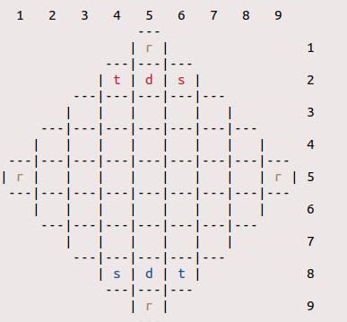

#### Intermediate game state representation

```
GameState([
    [ e-e , e-e , e-e , e-e  , r-1  , e-e  , e-e , e-e , e-e ],
    [ e-e , e-e , e-e , t-p2 , x-x  , s-p2 , e-e , e-e , e-e ],
    [ e-e , e-e , x-x , x-x  , x-x  , x-x  , x-x , e-e , e-e ], 
    [ e-e , x-x , x-x , x-x  , d-p2 , x-x  , x-x , x-x , e-e ],
    [ r-1 , x-x , x-x , x-x  , x-x  , x-x  , x-x , x-x , r-3 ], 
    [ e-e , x-x , x-x , x-x  , x-x  , x-x  , x-x , x-x , e-e ],
    [ e-e , e-e , x-x , s-p1 , x-x  , x-x  , x-x , e-e , e-e ], 
    [ e-e , e-e , e-e , x-x  , d-p1 , t-p1 , e-e , e-e , e-e ],
    [ e-e , e-e , e-e , e-e  , r-4  , e-e  , e-e , e-e , e-e ]
], p1, 1, 3).
```

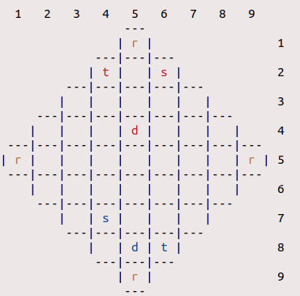


#### Final game state representation

```
GameState([
    [ e-e , e-e , e-e , e-e  , t-p2 , e-e  , e-e , e-e , e-e ],
    [ e-e , e-e , e-e , x-x  , x-x  , s-p2 , e-e , e-e , e-e ],
    [ e-e , e-e , x-x , x-x  , x-x  , x-x  , x-x , e-e , e-e ], 
    [ e-e , x-x , x-x , x-x  , d-p1 , x-x  , x-x , x-x , e-e ],
    [ r-1 , x-x , x-x , x-x  , x-x  , x-x  , x-x , x-x , r-3 ], 
    [ e-e , x-x , x-x , x-x  , x-x  , x-x  , x-x , x-x , e-e ],
    [ e-e , e-e , x-x , x-x  , r-1  , x-x  , x-x , e-e , e-e ], 
    [ e-e , e-e , e-e , x-x  , d-p1 , t-p1 , e-e , e-e , e-e ],
    [ e-e , e-e , e-e , e-e  , r-4  , e-e  , e-e , e-e , e-e ]
], p1, 3, 5).
```

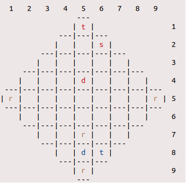

---

### Game State Visualization

Firstly, we have crafted a user-friendly **menu system** to enhance the overall gaming experience. Within our menu system, players can:

- **(1)** Select their desired **game mode**, whether it is Human/Human, Human/Computer, or Computer/Computer.

   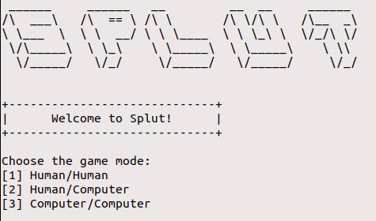

- **(2)** Enter the human's **names** that will play the game

- **(3)** Choose a customizable **board size**, with certain restrictions

   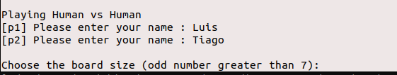

- **(4)** Select **level of difficulty** when playing against the computer

   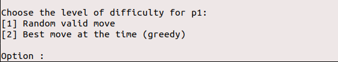


To maintain the integrity of the system, we have implemented robust input validation mechanisms, ensuring that users provide valid inputs:

- in **(1)** and **(4)**, the input is validated using the predicate **select_option/3**, which prompts the user for input and ensures that the input is within a specified range (Min to Max). If the input is within the range, the predicate succeeds; otherwise, it fails and makes use of **repeat/0** to ask the user for input again. 

```
% select_option(+Min, +Max, -Option)
select_option(Min, Max, Option) :-
    write('Option : '),
    repeat,
    read_number_input(Option),
    (between(Min, Max, Option) -> true ; 
    format('Invalid input. Please enter a number between ~d and ~d: ', [Min, Max]), fail).
```

- in **(2)**, we opt to use the predicate **read_string_input/2** to enhand user experience, as it reads a string from the input character by character until a newline character is reached.

```
% read_string_input(-String, +CurString)
read_string_input(String, CurString) :-
    get_char(Char),
    Char \= '\n',
    append(CurString, [Char], UpdatedString),
    read_string_input(String, UpdatedString).
```

- in **(3)**, the predicate **select_board/1** prompts the user for a customizable board size, ensuring that the input is an odd number greater than 7.

```
% select_board(-Size)
select_board(Size) :-
    repeat,
    read_number_input(Size),
    ((Size > 7 , Size mod 2 =:= 1) -> true ; 
    write('Invalid input. Please enter an odd number greater than 7: '), fail).
```

Once all these initial configurations are done, the predicate **initial_state/2** is called, in order to create a flexible game state, that works with any board size greater than 7:

```
initial_state(Size, [Board, p1, 1, 1]) :-
    create_board(Size, Board).
```

Moving on to the game playing state, we display the player and their turn to play, as the board is displayed using **display_game/1** that, in consequense, calls **display_board/1** and this last one calls **display_rows/3** on to display the board as a set of rows. Each row is displayed with its elements in the appropriate colors, making use of the ansi color codes, that prolog does support, as special output characters with the **format/3** predicate. The player one is blue, while the player two is red, and the rocks are all brown given that they do not belong to any player.

```
display_game([Board, Player, Move, Turn]) :-
    display_turn(Player, Move, Turn),
    (\+computer_level(Player, _) -> display_board(Board); true).
```

**Note:** In order to make the interface more user friendly, we opted not to display the board when the computer was playing.

---

### Move Validation and Execution

Picking a move always follows the same four steps, despite every single piece having different move restrictions:

- **(1)** Select the desired piece and direction calling **choose_piece/2** and **choose_direction/1**

- **(2)** Validate the move with the appropriate function for the character, being the triage done with the predicate **valid_move/5**

- **(3)** Perform the now validated move with **move/3**, calling again each of the appropriate move functions, while also choosing additional movement quirks like the direction to throw the rock, if you want to pull a rock or if you want to levitate a rock and also performing validation of such choices
- **(4)** Update player's turn and move number, according to their played movement - **next_turn/2**

The boardstate and the position predicates both are updated upon successfully moving a piece, done with **general_move/5**.

```
game_cycle(GameState) :-
    display_game(GameState), !,
    choose_move(GameState, Move),
    move(GameState, Move, Temp),
    next_turn(Temp, NewGameState),
    game_cycle(NewGameState).

% move(+GameState, +Move, -NewGameState)
move([Board, Player, Move, Turn], Piece-Direction, NewGameState) :-   
    \+computer_level(Player, _),  
    (
        Piece == t -> troll_move([Board, Player, Move, Turn], Direction, NewGameState);
        Piece == s -> sorcerer_move([Board, Player, Move, Turn], Direction, NewGameState);
        Piece == d -> dwarf_move([Board, Player, Move, Turn], Direction, NewGameState)
    ), !.

% update_piece_pos(+Piece, +NewPos)
update_piece_pos(Piece, NewPos) :-
    retract(position(Piece, _)),
    asserta(position(Piece, NewPos)).
```

---

### List of Valid Moves

As we can and do make an individual check on moves to evaluate their validity, the **valid_moves/2** function is nothing more than a **findall/3** call with a few restrictions in between. This function does exactly what it says, finds all valid moves. 
Similar jobs are performed by the functions **troll_paths/3**, that finds the appropriate moves for the Stonetroll, or **possible_paths/3**, that finds all the possible tiles you can reach in one round and all the valid paths to them.

```
% valid_moves(+GameState, -ListOfMoves)
valid_moves([Board, Player, _, _], ListOfMoves) :-
    length(Board, Size),
    Pieces = [t, d, s],
    Directions = [1, 2, 3, 4],
    findall(Piece-Direction, (
        member(Piece, Pieces),
        member(Direction, Directions),
        position(Piece-Player, Pos),
        valid_move(Board, Piece-Player, Pos, Size, Direction)
    ), ListOfMoves).
```

---

### End of Game

The game ends when one of the teams manages to have the Stonetroll throw a rock at the opponent's Sorcerer. As such, we check if the Sorcerer is missing, and only then does the **game_cycle/1** predicate end the game and declare a winner, making use of a base case with cuts to cease the cycle.

```
% game_over(-Winner)
game_over(Winner) :-
    (\+ position(s-p1, _)) -> Winner = p2 ;
    (\+ position(s-p2, _)) -> Winner = p1 ;
    false.
```


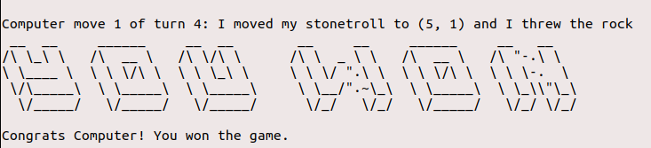


---

### Game State Evaluation

Given that the pieces do not have any inherent value for them as you cannot capture them like in chess, and there are only 3 pieces, all with different functions, we opted to not use a traditional value system for a boardstate, given the absense of patterns in our game and its unorthodoxical victory conditions. Instead, **value/2** only exists for the computer to know if it can make an attack on the enemy and win, if the Sorcerer needs protection/to flee or if you are free to make moves with the Stonetroll and Dwarf to advance the board state, varying then only between these 3 values, -1, 1 and 0.

- If the value is 1, it signifies the potential to swiftly assail the opponent's sorcerer within a single turn, leading to an instantaneous victory.

- If the value is -1, it indicates that the opponent can launch an attack on our sorcerer in their upcoming turn, putting us at risk of defeat.

- If the value is 0, the game remains in a state of equilibrium, where victory is still attainable by either party, making the outcome unpredictable.

```
% value(+GameState, -Value) 
% Evaluates the current game state 
value([Board, Player, _, _], 1) :- can_attack(Board, Player), !.
value([Board, Player, _, _], -1) :- need_protection(Board, Player), !.
value(_, 0) :- !.
```

---

### Computer Plays

#### Computer level 1

This computer does not possess any form of algorythmic behaviour, it simply knows the list of valid moves and randomly picks one every time.

```
% choose_move(+Board, +Player, +Level, -Move)
choose_move(GameState, 1, Move) :-
    valid_moves(GameState, ListOfMoves),
    random_member(Move, ListOfMoves).
```

As each piece has its own special ability, this computer also chooses randomly whether it wants to use it or not.

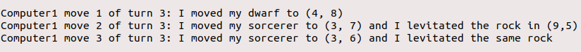

#### Computer level 2

The moves the computer makes are exactly defined as aforementioned. The directives are clear, and despite that, the computer still has an algorythmical way to determine where to move each piece when it does, adapting to each boardstate independently while still following orders.

First and foremost, if there is a possibility to vanquish the opponent's sorcerer within a single turn, the computer seizes the opportunity and executes the decisive move.

In the absence of an immediate victory opportunity, the computer prioritizes safeguarding its own sorcerer if it is under threat of imminent attack. Ensuring the safety of its vital pieces is paramount to the computer's strategy.

If neither a swift victory nor a defensive maneuver is necessary, the computer strategically advances its stonetrolls closer to the rocks, positioning them for potential throws. Simultaneously, the dwarfs are strategically relocated to the middle of the board. This strategic placement serves the dual purpose of blocking opponents' paths and establishing control over key areas of the game board.

By adhering to these strategic principles, the computer adapts its moves intelligently, maximizing its chances of success while adhering to the specified guidelines.

```
choose_move([Board, Player, NrMove, Turn], 2, Move) :-
    (\+greedy_move(_, NrMove, Turn) ->
        value([Board, Player, NrMove, Turn], Value),
        (
            Value == 1 -> attack([Board, Player, NrMove, Turn], Move);
            Value == -1 -> 
                (can_protect([Board, Player, NrMove, Turn]) ->
                    protect_sorcerer([Board, Player, 1, Turn], Move);
                    move_closer([Board, Player, 1, Turn], Move)
                );
            move_closer([Board, Player, 1, Turn], Move)
        )
    ;
    greedy_move(Move, NrMove, Turn)
    ).
```

---

### Conclusions

In Prolog, we've successfully realized Splut! with diverse game modes, customizable boards, and meticulous user input validation. A highlight of our achievement is the implementation of the Greedy Bot, a challenging opponent requiring intricate strategic coding. Our user-friendly interfaces ensure easy navigation, making Splut! accessible to all. With Splut! in Prolog, players can enjoy an immersive, strategic gaming experience.

